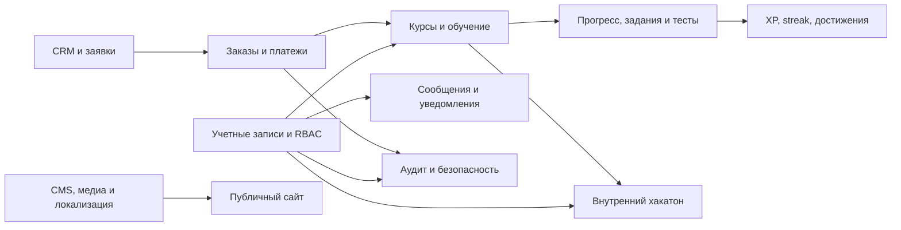
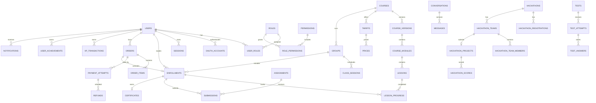

# Полная схема базы данных «Окурмен IT» для Neon PostgreSQL

**Источник требований:** `okurmen-it-updated-spec.md`  
**Целевая СУБД:** Neon PostgreSQL  
**Статус:** проект схемы, готовый для декомпозиции на миграции  
**Дата:** 24 сентября 2026 г.

> Этот документ является логической и физической моделью данных. Он не применяет изменения к production-базе автоматически. Перед внедрением схема разбивается на небольшие миграции, проверяется на отдельной ветке Neon и только затем переносится в production.

## 1. Основные решения

- Все первичные ключи — `uuid` с `DEFAULT gen_random_uuid()`.
- Все даты событий — `timestamptz`, календарные даты — `date`, локальное время занятия — `time` вместе с IANA-часовым поясом.
- Деньги хранятся целым `bigint` в минимальных единицах валюты: `2500000` = 25 000,00 KGS. Валюта — `char(3)`.
- Имена таблиц и колонок — `snake_case`; время создания/изменения — `created_at`, `updated_at`.
- Пользователь существует один раз в `users`. `ADMIN`, `MENTOR`, `STUDENT` — назначения в `user_roles`; отдельных дублирующих учетных записей `admins` нет.
- `student_profiles`, `mentor_profiles`, `staff_profiles` расширяют пользователя предметными данными и не являются отдельными аккаунтами.
- Контент переводится через `*_translations`. Обязательные локали: `ru`, `ky`, `en`.
- Файлы лежат в S3-совместимом хранилище. PostgreSQL хранит метаданные, права и ключ объекта, но не бинарное содержимое.
- Финансовые и учебные события не удаляются физически. Для редактируемого контента применяется `archived_at`/`deleted_at`; платежи, попытки, оценки, согласия и аудит сохраняются.
- Внешние callback-и и фоновые задачи идемпотентны. Уникальный `provider_event_id` не позволяет обработать webhook дважды.
- `jsonb` используется только для снимков, настроек, provider payload и типов ответов с переменной структурой. Основные связи остаются реляционными.
- Бизнес-права проверяет сервер. PostgreSQL constraints защищают инварианты, но не заменяют authorization service.

## 2. Расширения и общие домены

```sql
CREATE EXTENSION IF NOT EXISTS pg_trgm;
CREATE EXTENSION IF NOT EXISTS citext;

CREATE DOMAIN currency_code AS char(3)
  CHECK (VALUE ~ '^[A-Z]{3}$');

CREATE DOMAIN locale_code AS varchar(10)
  CHECK (VALUE IN ('ru', 'ky', 'en'));

CREATE DOMAIN non_negative_money AS bigint
  CHECK (VALUE >= 0);

CREATE DOMAIN percentage AS numeric(5,2)
  CHECK (VALUE >= 0 AND VALUE <= 100);
```

`gen_random_uuid()` доступен в актуальном PostgreSQL. `pg_trgm` используется для поиска по названиям, людям и статьям; `citext` — для регистронезависимого email.

## 3. Справочник статусов

В Drizzle эти значения оформляются как PostgreSQL enums. Если продукту понадобится настройка workflow через админку, изменяемые статусы следует вынести в lookup-таблицы.

| Enum | Значения |
|---|---|
| `user_status` | `INVITED`, `PENDING_VERIFICATION`, `ACTIVE`, `BLOCKED`, `ARCHIVED` |
| `app_role` | `ADMIN`, `MENTOR`, `STUDENT` |
| `publication_status` | `DRAFT`, `REVIEW`, `PUBLISHED`, `ARCHIVED` |
| `course_level` | `BEGINNER`, `ELEMENTARY`, `INTERMEDIATE`, `ADVANCED`, `ALL_LEVELS` |
| `course_format` | `ONLINE`, `OFFLINE`, `HYBRID`, `SELF_PACED` |
| `group_status` | `DRAFT`, `ENROLLMENT_OPEN`, `ACTIVE`, `COMPLETED`, `CANCELLED`, `ARCHIVED` |
| `enrollment_status` | `PENDING`, `ACTIVE`, `PAUSED`, `COMPLETED`, `WITHDRAWN`, `TRANSFERRED`, `CANCELLED` |
| `attendance_status` | `PRESENT`, `ABSENT`, `LATE`, `EXCUSED` |
| `lesson_progress_status` | `LOCKED`, `AVAILABLE`, `IN_PROGRESS`, `COMPLETED` |
| `assignment_progress_status` | `NEW`, `IN_PROGRESS`, `SUBMITTED`, `CHECKING`, `APPROVED`, `REVISION_REQUIRED`, `COMPLETED`, `OVERDUE` |
| `submission_status` | `DRAFT`, `SUBMITTED`, `CHECKING`, `APPROVED`, `REVISION_REQUIRED`, `SUPERSEDED`, `LATE` |
| `question_type` | `SINGLE_CHOICE`, `MULTIPLE_CHOICE`, `TRUE_FALSE`, `TEXT`, `MATCHING`, `ORDERING`, `CODE`, `IMAGE_ANSWER` |
| `attempt_status` | `IN_PROGRESS`, `SUBMITTED`, `AUTO_GRADED`, `REVIEW_REQUIRED`, `GRADED`, `EXPIRED`, `CANCELLED` |
| `lead_status` | `NEW`, `CONTACTED`, `TRIAL`, `INTERESTED`, `WAITING_PAYMENT`, `PAID`, `STUDENT`, `REJECTED` |
| `reservation_status` | `ACTIVE`, `EXPIRED`, `CONVERTED`, `CANCELLED` |
| `order_status` | `DRAFT`, `RESERVED`, `PENDING_PAYMENT`, `PAID`, `ENROLLED`, `PAYMENT_FAILED`, `EXPIRED`, `CANCELLED`, `REFUND_PENDING`, `REFUNDED`, `PARTIALLY_REFUNDED`, `MANUAL_REVIEW` |
| `payment_status` | `CREATED`, `PENDING`, `AUTHORIZED`, `PAID`, `FAILED`, `CANCELLED`, `REFUND_PENDING`, `REFUNDED`, `PARTIALLY_REFUNDED` |
| `refund_status` | `REQUESTED`, `APPROVED`, `PROCESSING`, `SUCCEEDED`, `FAILED`, `REJECTED` |
| `review_status` | `PENDING`, `APPROVED`, `REJECTED`, `ARCHIVED` |
| `review_author_type` | `STUDENT`, `PARENT`, `GRADUATE` |
| `ticket_status` | `OPEN`, `IN_PROGRESS`, `WAITING_FOR_STUDENT`, `RESOLVED`, `CLOSED` |
| `conversation_type` | `DIRECT`, `GROUP`, `SUPPORT`, `MENTORSHIP` |
| `notification_channel` | `IN_APP`, `EMAIL`, `TELEGRAM` |
| `delivery_status` | `PENDING`, `PROCESSING`, `SENT`, `DELIVERED`, `FAILED`, `SKIPPED` |
| `certificate_status` | `PENDING`, `ISSUED`, `REVOKED` |
| `hackathon_status` | `DRAFT`, `REGISTRATION_OPEN`, `REGISTRATION_CLOSED`, `IN_PROGRESS`, `SUBMISSION_OPEN`, `JUDGING`, `RESULTS_PUBLISHED`, `FINISHED`, `CANCELLED` |
| `hackathon_registration_status` | `REGISTERED`, `WAITLISTED`, `APPROVED`, `REJECTED`, `WITHDRAWN`, `DISQUALIFIED` |
| `hackathon_team_status` | `FORMING`, `READY`, `SUBMITTED`, `DISQUALIFIED`, `WITHDRAWN` |
| `challenge_period` | `DAILY`, `WEEKLY` |
| `job_status` | `PENDING`, `RUNNING`, `SUCCEEDED`, `FAILED`, `CANCELLED` |

## 4. Карта доменов



## 5. Учетные записи, Auth.js и RBAC

### `users`

| Колонка | Тип | Правила |
|---|---|---|
| `id` | `uuid` | PK |
| `status` | `user_status` | not null, default `PENDING_VERIFICATION` |
| `first_name`, `last_name` | `varchar(100)` | nullable до заполнения профиля |
| `display_name` | `varchar(160)` | nullable |
| `email` | `citext` | nullable, unique where not null |
| `phone_e164` | `varchar(20)` | nullable, unique where not null, формат E.164 |
| `email_verified_at`, `phone_verified_at` | `timestamptz` | nullable |
| `avatar_media_id` | `uuid` | FK → `media_assets.id`, `SET NULL` |
| `preferred_locale` | `locale_code` | default `ru` |
| `timezone` | `varchar(64)` | IANA, default `Asia/Bishkek` |
| `last_login_at`, `blocked_at`, `archived_at` | `timestamptz` | nullable |
| `created_at`, `updated_at` | `timestamptz` | not null |

Email и телефон имеют отдельные partial unique indexes. Хотя Auth.js использует email, подтвержденные контакты дополнительно нормализуются в `user_contacts`.

### Остальные таблицы идентификации

| Таблица | Ключевые поля | Связи и ограничения |
|---|---|---|
| `user_contacts` | `id`, `user_id`, `type`, `value`, `normalized_value`, `is_primary`, `verified_at` | FK → users; unique `(type, normalized_value)`; не более одного primary каждого типа на пользователя |
| `oauth_accounts` | `id`, `user_id`, `provider`, `provider_account_id`, `type`, `access_token_encrypted`, `refresh_token_encrypted`, `expires_at`, `scope` | Auth.js adapter; unique `(provider, provider_account_id)`; токены шифруются приложением/KMS |
| `sessions` | `id`, `user_id`, `session_token_hash`, `expires_at`, `revoked_at`, `ip_hash`, `user_agent`, `last_seen_at` | unique hash; удаление/отзыв инвалидирует вход |
| `verification_tokens` | `id`, `identifier`, `purpose`, `token_hash`, `expires_at`, `consumed_at`, `attempt_count` | хранится только hash; index `(identifier, purpose, expires_at)` |
| `password_credentials` | `user_id`, `password_hash`, `password_changed_at`, `failed_attempts`, `locked_until` | optional 1:1; только если включен парольный вход |
| `mfa_methods` | `id`, `user_id`, `type`, `secret_encrypted`, `label`, `verified_at`, `last_used_at`, `disabled_at` | ADMIN обязан иметь хотя бы один активный метод, проверяется сервисом |
| `mfa_recovery_codes` | `id`, `mfa_method_id`, `code_hash`, `used_at` | код одноразовый |
| `login_attempts` | `id`, `identifier_hash`, `user_id`, `success`, `ip_hash`, `user_agent`, `failure_reason`, `created_at` | append-only; indexes по времени и hash |
| `roles` | `id`, `code`, `name` | seed: ADMIN, MENTOR, STUDENT; unique `code` |
| `permissions` | `id`, `code`, `description` | например `courses.manage`, `finance.refund`; unique `code` |
| `user_roles` | `user_id`, `role_id`, `assigned_by`, `assigned_at`, `revoked_at` | PK `(user_id, role_id)` для активной записи либо surrogate id + partial unique active |
| `role_permissions` | `role_id`, `permission_id` | PK из двух FK |
| `user_permissions` | `user_id`, `permission_id`, `effect`, `granted_by`, `expires_at` | точечный `ALLOW`/`DENY`; unique active assignment |
| `student_profiles` | `user_id`, `birth_date`, `guardian_name`, `guardian_contact`, `education_level`, `goals`, `onboarding_completed_at` | 1:1 users; данные опекуна доступны только уполномоченным сотрудникам |
| `mentor_profiles` | `user_id`, `bio`, `experience_years`, `specialties`, `is_public`, `booking_enabled` | 1:1 users; переводимое bio вынесено в `person_profile_translations` при публикации |
| `staff_profiles` | `user_id`, `job_title`, `department`, `employee_number`, `hired_at`, `terminated_at`, `is_public` | 1:1 users |
| `user_devices` | `id`, `user_id`, `device_hash`, `label`, `first_seen_at`, `last_seen_at`, `revoked_at` | безопасность сессий и админ-аудит |
| `user_preferences` | `user_id`, `theme`, `locale`, `timezone`, `reduced_motion`, `settings_json` | 1:1; CHECK темы `SYSTEM/LIGHT/DARK` |

## 6. Согласия и юридические документы

| Таблица | Ключевые поля | Связи и ограничения |
|---|---|---|
| `legal_documents` | `id`, `code`, `type`, `status`, `current_version_id`, timestamps | unique `code`; типы: privacy, terms, offer, refund, cookies |
| `legal_document_versions` | `id`, `document_id`, `version`, `effective_from`, `content_hash`, `published_at`, `created_by` | unique `(document_id, version)`; опубликованные версии неизменяемы |
| `legal_document_translations` | `id`, `version_id`, `locale`, `title`, `body_md` | unique `(version_id, locale)` |
| `user_consents` | `id`, `user_id`, `lead_id`, `document_version_id`, `purpose`, `granted`, `granted_at`, `withdrawn_at`, `ip_hash`, `user_agent` | требуется `user_id` или `lead_id`; append-only история |
| `marketing_preferences` | `user_id`, `email_opt_in`, `sms_opt_in`, `telegram_opt_in`, `updated_at`, `source` | текущее состояние; история подтверждается `user_consents` |

### Рекомендуемый каталог permission codes

| Область | Permissions |
|---|---|
| Пользователи | `users.read`, `users.manage`, `roles.assign`, `permissions.manage`, `security.audit` |
| Контент | `content.read`, `content.write`, `content.review`, `content.publish`, `media.manage` |
| Обучение | `courses.read`, `courses.manage`, `groups.manage`, `attendance.manage`, `learning.publish` |
| Проверка | `assignments.manage`, `submissions.review`, `tests.manage`, `projects.review`, `certificates.issue` |
| Продажи | `leads.read`, `leads.manage`, `consultations.manage`, `orders.read` |
| Финансы | `finance.read`, `payments.reconcile`, `refunds.request`, `refunds.approve`, `prices.manage` |
| Коммуникации | `messages.moderate`, `support.manage`, `notifications.send`, `integrations.manage` |
| Маркетинг | `reviews.moderate`, `graduates.manage`, `events.manage`, `analytics.read`, `analytics.export` |
| Хакатон | `hackathons.manage`, `hackathons.judge`, `hackathons.publish_results` |
| Владелец | `owner` — управление критичными правами, integrations и security policy |

Базовая роль `STUDENT` не получает административных permissions: доступ к собственным объектам определяется ownership/enrollment. `MENTOR` получает только данные назначенных групп и submissions. `ADMIN` также ограничивается permissions; роль не означает автоматический полный доступ к финансам и owner-настройкам.

## 7. Медиа и объектное хранилище

### `media_assets`

| Колонка | Тип | Правила |
|---|---|---|
| `id` | `uuid` | PK |
| `storage_provider`, `bucket`, `object_key` | `varchar` | unique `(storage_provider, bucket, object_key)` |
| `original_name`, `mime_type` | `varchar` | not null |
| `media_type` | `varchar(24)` | `IMAGE`, `VIDEO`, `AUDIO`, `PDF`, `DOCUMENT`, `PRESENTATION`, `ZIP`, `CODE` |
| `size_bytes` | `bigint` | `>= 0` |
| `checksum_sha256` | `char(64)` | проверка целостности |
| `width`, `height`, `duration_seconds` | integer/numeric | nullable по типу |
| `status` | `varchar(20)` | `UPLOADING`, `READY`, `QUARANTINED`, `REJECTED`, `DELETED` |
| `visibility` | `varchar(20)` | `PUBLIC`, `AUTHENTICATED`, `PRIVATE` |
| `uploaded_by`, `created_at`, `deleted_at` | uuid/timestamps | FK users |
| `metadata` | `jsonb` | технические метаданные, default `{}` |

Дополнительные таблицы:

- `media_variants(id, source_media_id, kind, media_id, width, height)` — thumbnail/WebP/AVIF/subtitle.
- `media_access_grants(id, media_id, user_id, enrollment_id, expires_at)` — доступ к приватным материалам.
- `upload_sessions(id, user_id, purpose, object_key, expected_size, expires_at, completed_at)` — безопасная прямая загрузка в S3.

## 8. Академия, филиалы и публичные люди

| Таблица | Основные поля | Ограничения/связи |
|---|---|---|
| `branches` | `id`, `slug`, `phone`, `email`, `latitude`, `longitude`, `timezone`, `working_hours_json`, `status`, `map_url` | unique slug; координаты CHECK диапазона |
| `branch_translations` | `branch_id`, `locale`, `name`, `address`, `description`, `route_hint` | unique `(branch_id, locale)` |
| `classrooms` | `id`, `branch_id`, `name`, `capacity`, `equipment_json`, `accessible`, `status` | capacity > 0 |
| `classroom_media` | `classroom_id`, `media_id`, `sort_order` | PK/FK |
| `person_profiles` | `id`, `user_id`, `slug`, `kind`, `photo_media_id`, `is_public`, `sort_order`, `consent_expires_at`, `published_at` | kind: FOUNDER/TEACHER/MENTOR/TEAM; user optional для внешнего преподавателя |
| `person_profile_translations` | `profile_id`, `locale`, `name`, `job_title`, `short_bio`, `bio` | unique `(profile_id, locale)` |
| `person_social_links` | `id`, `profile_id`, `platform`, `url`, `sort_order` | разрешенный protocol HTTPS |
| `companies` | `id`, `slug`, `name`, `website_url`, `logo_media_id`, `is_verified` | unique slug |
| `graduates` | `id`, `user_id`, `public_name`, `photo_media_id`, `graduation_year`, `company_id`, `job_title`, `profile_url`, `story_status`, `verified_at`, `consent_expires_at` | публикация только при active consent и verified_at |
| `graduate_courses` | `graduate_id`, `course_id` | M:N |
| `graduate_translations` | `graduate_id`, `locale`, `story`, `quote` | unique locale |
| `student_stories` | `id`, `user_id`, `course_id`, `status`, `cover_media_id`, `published_at`, `consent_expires_at` | только APPROVED/PUBLISHED публично |
| `student_story_translations` | `story_id`, `locale`, `title`, `summary`, `body` | unique locale |

## 9. Каталог курсов и версии программ

### Основные сущности

| Таблица | Основные поля | Ограничения/связи |
|---|---|---|
| `course_categories` | `id`, `slug`, `parent_id`, `status`, `sort_order` | self-FK; unique slug |
| `course_category_translations` | `category_id`, `locale`, `name`, `description` | unique `(category_id, locale)` |
| `courses` | `id`, `slug`, `category_id`, `status`, `level`, `default_format`, `cover_media_id`, `duration_value`, `duration_unit`, `is_featured`, `published_version_id`, `published_at`, `archived_at` | unique slug; published_version FK deferred |
| `course_translations` | `course_id`, `locale`, `title`, `short_description`, `description`, `learning_outcomes`, `requirements`, `seo_title`, `seo_description` | unique locale; SEO title/description nullable |
| `course_versions` | `id`, `course_id`, `version`, `status`, `change_summary`, `created_by`, `published_at` | unique `(course_id, version)`; immutable after publish |
| `course_modules` | `id`, `course_version_id`, `position`, `is_required`, `unlock_rule_json` | unique `(course_version_id, position)` |
| `course_module_translations` | `module_id`, `locale`, `title`, `description` | unique locale |
| `lessons` | `id`, `module_id`, `position`, `lesson_type`, `estimated_minutes`, `is_required`, `available_from_offset_days`, `status` | unique `(module_id, position)` |
| `lesson_translations` | `lesson_id`, `locale`, `title`, `summary`, `content_json` | rich content blocks; unique locale |
| `lesson_materials` | `id`, `lesson_id`, `media_id`, `external_url`, `kind`, `position`, `is_downloadable` | ровно один из media/url |
| `course_staff` | `id`, `course_id`, `user_id`, `staff_type`, `starts_at`, `ends_at`, `is_public` | staff_type TEACHER/MENTOR/AUTHOR; no overlapping duplicate active assignment |
| `course_prerequisites` | `course_id`, `prerequisite_course_id`, `required` | PK pair; запрет self-link |
| `course_tags` | `id`, `slug` | unique slug |
| `course_tag_translations` | `tag_id`, `locale`, `name` | unique locale |
| `course_tag_links` | `course_id`, `tag_id` | PK pair |

### Тарифы, цены и скидки

| Таблица | Основные поля | Ограничения/связи |
|---|---|---|
| `tariffs` | `id`, `course_id`, `code`, `status`, `access_days`, `includes_mentor`, `includes_recordings`, `features_json`, timestamps | unique `(course_id, code)` |
| `tariff_translations` | `tariff_id`, `locale`, `name`, `description` | unique locale |
| `prices` | `id`, `tariff_id`, `currency`, `amount_minor`, `valid_from`, `valid_until`, `is_active` | amount >= 0; запрет пересечения активных интервалов для тарифа/валюты |
| `discounts` | `id`, `name`, `type`, `value`, `currency`, `starts_at`, `ends_at`, `usage_limit`, `per_user_limit`, `status` | percent 0..100 либо fixed >=0 |
| `discount_targets` | `discount_id`, `course_id`, `tariff_id` | как минимум одна цель либо global flag в discounts |
| `promo_codes` | `id`, `discount_id`, `code`, `starts_at`, `ends_at`, `usage_limit`, `per_user_limit`, `status` | normalized uppercase unique code |
| `promo_redemptions` | `id`, `promo_code_id`, `user_id`, `order_id`, `discount_minor`, `created_at` | unique `(promo_code_id, order_id)` |

## 10. Группы, расписание, зачисление и посещаемость

| Таблица | Основные поля | Ограничения/связи |
|---|---|---|
| `groups` | `id`, `course_id`, `course_version_id`, `branch_id`, `classroom_id`, `code`, `status`, `format`, `capacity`, `starts_on`, `ends_on`, `enrollment_opens_at`, `enrollment_closes_at`, `timezone` | unique code; capacity > 0; dates ordered |
| `group_staff` | `group_id`, `user_id`, `role`, `starts_at`, `ends_at` | role TEACHER/MENTOR/ASSISTANT; unique active assignment |
| `group_schedule_rules` | `id`, `group_id`, `weekday`, `starts_at`, `ends_at`, `valid_from`, `valid_until`, `classroom_id`, `meeting_url` | weekday 1..7; end > start |
| `class_sessions` | `id`, `group_id`, `lesson_id`, `classroom_id`, `starts_at`, `ends_at`, `status`, `meeting_url`, `recording_media_id`, `notes` | конкретное занятие; end > start |
| `reservations` | `id`, `group_id`, `user_id`, `lead_id`, `status`, `expires_at`, `converted_order_id`, `created_at` | user или lead; partial unique active per person/group |
| `enrollments` | `id`, `user_id`, `course_id`, `group_id`, `tariff_id`, `order_item_id`, `status`, `access_starts_at`, `access_ends_at`, `enrolled_at`, `completed_at`, `transferred_from_id` | partial unique active `(user_id, course_id, group_id)` |
| `enrollment_status_history` | `id`, `enrollment_id`, `from_status`, `to_status`, `reason`, `changed_by`, `created_at` | append-only |
| `attendance_records` | `id`, `class_session_id`, `enrollment_id`, `status`, `minutes_late`, `reason`, `marked_by`, `marked_at` | unique `(session, enrollment)` |
| `waitlist_entries` | `id`, `group_id`, `user_id`, `lead_id`, `position`, `status`, `offered_at`, `offer_expires_at` | one active entry per person/group |

Ограничение вместимости нельзя надежно выразить одним CHECK. Бронирование и зачисление выполняются транзакцией с блокировкой строки `groups` и подсчетом активных reservations/enrollments.

## 11. Уроки и прогресс

| Таблица | Основные поля | Ограничения/связи |
|---|---|---|
| `lesson_progress` | `id`, `enrollment_id`, `lesson_id`, `status`, `progress_percent`, `started_at`, `completed_at`, `last_position_json`, `updated_at` | unique `(enrollment_id, lesson_id)`; 0..100 |
| `module_progress` | `id`, `enrollment_id`, `module_id`, `completed_required_count`, `required_count`, `progress_percent`, `completed_at` | derived/cache; unique pair |
| `course_progress` | `enrollment_id`, `progress_percent`, `completed_lessons`, `required_lessons`, `last_lesson_id`, `last_activity_at`, `completed_at` | 1:1 enrollment; пересчитывается из событий |
| `learning_activity_events` | `id`, `user_id`, `enrollment_id`, `activity_type`, `entity_type`, `entity_id`, `occurred_at`, `metadata` | append-only источник streak/аналитики; index user/time |
| `lesson_comments` | `id`, `lesson_id`, `user_id`, `parent_id`, `body`, `status`, timestamps | self-FK; soft delete/moderation |
| `bookmarks` | `id`, `user_id`, `entity_type`, `entity_id`, `note`, `created_at` | unique user/entity |

## 12. Задания, проекты и проверка

| Таблица | Основные поля | Ограничения/связи |
|---|---|---|
| `assignments` | `id`, `lesson_id`, `module_id`, `course_version_id`, `kind`, `status`, `max_score`, `passing_score`, `max_attempts`, `default_deadline_offset_days`, `allow_text`, `allow_url`, `allow_file`, `allowed_mime_types`, `max_file_bytes` | один parent-контекст; scores valid |
| `assignment_translations` | `assignment_id`, `locale`, `title`, `description`, `instructions` | unique locale |
| `assignment_attachments` | `assignment_id`, `media_id`, `position` | PK pair |
| `assignment_rubric_criteria` | `id`, `assignment_id`, `position`, `max_score`, `code` | sum criteria <= assignment max |
| `assignment_rubric_translations` | `criterion_id`, `locale`, `title`, `description` | unique locale |
| `student_assignment_states` | `id`, `assignment_id`, `enrollment_id`, `status`, `due_at`, `attempts_used`, `latest_submission_id`, `started_at`, `completed_at` | unique assignment/enrollment |
| `submissions` | `id`, `assignment_id`, `enrollment_id`, `attempt_number`, `status`, `answer_text`, `answer_url`, `repository_url`, `submitted_at`, `is_late`, `score`, `graded_at`, `graded_by` | unique `(assignment_id, enrollment_id, attempt_number)`; snapshot required |
| `submission_files` | `submission_id`, `media_id`, `kind`, `position` | PK composite |
| `submission_feedback` | `id`, `submission_id`, `author_id`, `body`, `visibility`, `created_at`, `edited_at` | история feedback, soft delete |
| `submission_rubric_scores` | `submission_id`, `criterion_id`, `score`, `comment` | PK pair; score <= criterion max |
| `projects` | `id`, `enrollment_id`, `course_version_id`, `title`, `description`, `repository_url`, `demo_url`, `status`, `submitted_at`, `approved_at` | итоговый или промежуточный проект |
| `project_files` | `project_id`, `media_id`, `position` | PK pair |
| `project_reviews` | `id`, `project_id`, `reviewer_id`, `score`, `decision`, `feedback`, `created_at` | append-only версии решения |

Снимок заголовка, инструкции и rubric на момент отправки хранится в `submissions.assignment_snapshot jsonb`, чтобы последующее редактирование задания не меняло историю оценки.

## 13. Тесты и диагностика

| Таблица | Основные поля | Ограничения/связи |
|---|---|---|
| `tests` | `id`, `lesson_id`, `module_id`, `course_version_id`, `purpose`, `status`, `time_limit_seconds`, `max_attempts`, `passing_percent`, `shuffle_questions`, `shuffle_options`, `question_limit`, `available_from`, `available_until` | purpose LESSON/MODULE/FINAL/DIAGNOSTIC |
| `test_translations` | `test_id`, `locale`, `title`, `description`, `instructions` | unique locale |
| `question_bank` | `id`, `course_id`, `type`, `difficulty`, `status`, `code_language`, `image_media_id`, `created_by` | reusable question |
| `question_translations` | `question_id`, `locale`, `prompt`, `explanation` | unique locale |
| `question_options` | `id`, `question_id`, `position`, `is_correct`, `pair_key`, `metadata` | answers hidden from student APIs |
| `question_option_translations` | `option_id`, `locale`, `label` | unique locale |
| `test_questions` | `test_id`, `question_id`, `position`, `points`, `required`, `variant_group` | unique pair and position |
| `test_attempts` | `id`, `test_id`, `enrollment_id`, `user_id`, `attempt_number`, `status`, `started_at`, `deadline_at`, `submitted_at`, `score`, `max_score`, `percent`, `passed`, `graded_at` | unique test/user/enrollment/attempt; server deadline |
| `test_attempt_questions` | `id`, `attempt_id`, `question_id`, `position`, `points`, `question_snapshot` | фиксирует случайный набор и текст |
| `test_answers` | `id`, `attempt_question_id`, `answer_json`, `is_correct`, `score`, `grader_id`, `feedback`, `saved_at`, `finalized_at` | unique attempt question; autosave |
| `diagnostic_results` | `id`, `attempt_id`, `user_id`, `level`, `direction_code`, `knowledge_score`, `recommended_course_id`, `recommendation_json`, `created_at` | рекомендация, не gate доступа |

Для `MATCHING`, `ORDERING`, `CODE` и текстового ответа `answer_json` имеет Zod-схему по `question_type`; корректные варианты не отправляются клиенту до завершения согласно политике теста.

## 14. Сертификаты

| Таблица | Основные поля | Ограничения/связи |
|---|---|---|
| `certificate_templates` | `id`, `course_id`, `name`, `background_media_id`, `layout_json`, `status`, `version` | unique course/version |
| `certificate_requirements` | `id`, `course_id`, `require_all_lessons`, `require_assignments`, `final_test_id`, `final_project_required`, `min_attendance_percent` | 1 active configuration per course |
| `certificates` | `id`, `certificate_number`, `verification_code_hash`, `user_id`, `enrollment_id`, `course_id`, `template_id`, `status`, `issued_at`, `revoked_at`, `revocation_reason`, `pdf_media_id`, `snapshot_json` | unique public number; one active cert/enrollment |
| `certificate_events` | `id`, `certificate_id`, `event_type`, `actor_id`, `reason`, `created_at` | append-only issue/revoke/regenerate |

Публичная проверка использует непредсказуемый `certificate_number`; в базе дополнительно хранится hash секретного verification code.

## 15. CRM, заявки и история контактов

| Таблица | Основные поля | Ограничения/связи |
|---|---|---|
| `leads` | `id`, `user_id`, `name`, `phone_e164`, `email`, `preferred_contact`, `interested_course_id`, `interested_format`, `source`, `utm_json`, `status`, `assigned_to`, `consent_version`, `created_at`, `updated_at`, `converted_at`, `rejected_reason` | partial unique/dedupe по нормализованному контакту и периоду; PII |
| `lead_events` | `id`, `lead_id`, `type`, `from_status`, `to_status`, `actor_id`, `note`, `scheduled_at`, `occurred_at`, `metadata` | append-only звонки, комментарии, статусы |
| `lead_tasks` | `id`, `lead_id`, `assignee_id`, `type`, `due_at`, `completed_at`, `status`, `note` | CRM reminders |
| `lead_course_interests` | `lead_id`, `course_id`, `priority` | PK pair |
| `consultation_bookings` | `id`, `lead_id`, `user_id`, `mentor_id`, `starts_at`, `ends_at`, `status`, `channel`, `meeting_url`, `notes` | end > start; предотвращение двойной брони |
| `acquisition_sources` | `id`, `code`, `name`, `is_active` | справочник источников |

Текущая минимальная `leads` из прототипа должна мигрировать в эту модель: `contact` разбирается на email/phone, `direction` — в `interested_course_id` либо справочный код, `dedupe_key` можно оставить внутренним полем до завершения миграции.

## 16. Заказы, платежи и возвраты

| Таблица | Основные поля | Ограничения/связи |
|---|---|---|
| `orders` | `id`, `order_number`, `user_id`, `lead_id`, `status`, `currency`, `subtotal_minor`, `discount_minor`, `total_minor`, `paid_minor`, `promo_code_id`, `reservation_id`, `offer_version_id`, `customer_snapshot`, timestamps | unique order number; totals >=0; user или lead |
| `order_items` | `id`, `order_id`, `course_id`, `group_id`, `tariff_id`, `title_snapshot`, `tariff_snapshot`, `unit_price_minor`, `discount_minor`, `total_minor`, `quantity` | immutable commercial snapshot |
| `order_status_history` | `id`, `order_id`, `from_status`, `to_status`, `actor_id`, `reason`, `created_at` | append-only |
| `payment_attempts` | `id`, `order_id`, `provider`, `provider_payment_id`, `idempotency_key`, `status`, `amount_minor`, `currency`, `method`, `checkout_url`, `expires_at`, `paid_at`, `failure_code`, `failure_message`, timestamps | unique provider payment/idempotency |
| `payment_provider_events` | `id`, `provider`, `provider_event_id`, `event_type`, `signature_valid`, `payload`, `received_at`, `processed_at`, `processing_error` | unique `(provider, provider_event_id)`; raw payload protected |
| `payment_allocations` | `id`, `payment_attempt_id`, `order_item_id`, `amount_minor` | sum <= paid amount |
| `refunds` | `id`, `payment_attempt_id`, `order_id`, `status`, `amount_minor`, `currency`, `reason`, `requested_by`, `approved_by`, `provider_refund_id`, timestamps | amount >0; separation of duties optional |
| `refund_events` | `id`, `refund_id`, `provider_event_id`, `status`, `payload`, `created_at` | append-only |
| `invoices` | `id`, `order_id`, `number`, `status`, `issued_at`, `media_id`, `provider_reference` | unique number |

### Транзакция подтверждения оплаты

```text
BEGIN
  1. INSERT payment_provider_events ON CONFLICT DO NOTHING
  2. SELECT order, payment_attempt FOR UPDATE
  3. проверить подпись, сумму, валюту и допустимость перехода
  4. обновить payment_attempt и order
  5. создать enrollment, если место доступно; иначе MANUAL_REVIEW
  6. записать order_status_history
  7. записать outbox_events(payment.confirmed)
COMMIT
```

Редирект браузера никогда не переводит заказ в `PAID`; источником истины служит подтвержденный webhook либо ручная сверка с аудитом.

## 17. Отзывы, CMS, блог, события и публичные настройки

| Таблица | Основные поля | Ограничения/связи |
|---|---|---|
| `reviews` | `id`, `author_user_id`, `author_type`, `course_id`, `rating`, `status`, `author_display_name`, `author_photo_id`, `verified_type`, `consent_expires_at`, `submitted_at`, `moderated_by`, `published_at` | rating 1..5; публично только APPROVED и active consent |
| `review_translations` | `review_id`, `locale`, `body` | unique locale |
| `site_pages` | `id`, `slug`, `status`, `template`, `published_at`, `seo_image_id` | unique slug |
| `site_page_translations` | `page_id`, `locale`, `title`, `body_json`, `seo_title`, `seo_description` | unique locale |
| `landing_sections` | `id`, `code`, `status`, `position`, `variant`, `settings_json`, `published_at` | unique code; position unique among active sections |
| `landing_section_translations` | `section_id`, `locale`, `content_json` | unique locale; validated per section code |
| `banners` | `id`, `code`, `status`, `media_id`, `starts_at`, `ends_at`, `target_url`, `position` | active range |
| `banner_translations` | `banner_id`, `locale`, `title`, `body`, `cta_label` | unique locale |
| `faq_categories` | `id`, `slug`, `position`, `status` | unique slug |
| `faq_category_translations` | `category_id`, `locale`, `name` | unique locale |
| `faq_items` | `id`, `category_id`, `status`, `position`, `published_at` | ordered |
| `faq_item_translations` | `faq_id`, `locale`, `question`, `answer` | unique locale |
| `blog_posts` | `id`, `slug`, `author_id`, `status`, `cover_media_id`, `published_at`, `archived_at` | unique slug |
| `blog_post_translations` | `post_id`, `locale`, `title`, `excerpt`, `body_json`, `seo_title`, `seo_description` | unique locale |
| `blog_categories` | `id`, `slug`, `status` | unique slug |
| `blog_post_categories` | `post_id`, `category_id` | PK pair |
| `events` | `id`, `slug`, `event_type`, `status`, `branch_id`, `starts_at`, `ends_at`, `capacity`, `price_minor`, `currency`, `cover_media_id`, `registration_url` | dates ordered; price >=0 |
| `event_translations` | `event_id`, `locale`, `title`, `summary`, `description`, `location_label` | unique locale |
| `event_registrations` | `id`, `event_id`, `user_id`, `lead_id`, `status`, `registered_at` | user или lead; unique active attendee |
| `social_links` | `id`, `platform`, `url`, `label`, `status`, `position` | HTTPS/approved schemes |
| `site_settings` | `key`, `value_json`, `updated_by`, `updated_at` | allowlist ключей; секреты здесь запрещены |
| `content_revisions` | `id`, `entity_type`, `entity_id`, `revision`, `snapshot`, `created_by`, `created_at` | immutable CMS history |

## 18. Сообщения, менторство и центр помощи

| Таблица | Основные поля | Ограничения/связи |
|---|---|---|
| `conversations` | `id`, `type`, `group_id`, `subject`, `created_by`, `created_at`, `closed_at` | одна group-conversation при необходимости |
| `conversation_participants` | `conversation_id`, `user_id`, `role`, `joined_at`, `left_at`, `last_read_message_id`, `muted_until` | PK active membership |
| `messages` | `id`, `conversation_id`, `sender_id`, `body`, `reply_to_id`, `created_at`, `edited_at`, `deleted_at` | soft delete; индекс conversation/time |
| `message_attachments` | `message_id`, `media_id`, `position` | PK composite |
| `mentor_help_requests` | `id`, `student_id`, `enrollment_id`, `mentor_id`, `subject`, `description`, `priority`, `status`, timestamps | ownership server-side |
| `mentor_recommendations` | `id`, `mentor_id`, `student_id`, `enrollment_id`, `body`, `visibility`, `created_at` | history |
| `mentor_availability_slots` | `id`, `mentor_id`, `starts_at`, `ends_at`, `capacity`, `status` | exclusion constraint для overlapping active slots |
| `mentor_sessions` | `id`, `slot_id`, `student_id`, `mentor_id`, `status`, `meeting_url`, `agenda`, `outcome`, timestamps | unique booking if capacity 1 |
| `support_categories` | `id`, `code`, `name`, `sla_hours`, `status` | unique code |
| `support_tickets` | `id`, `number`, `requester_id`, `category_id`, `assigned_to`, `status`, `priority`, `subject`, timestamps | unique number |
| `support_ticket_messages` | `id`, `ticket_id`, `author_id`, `body`, `is_internal`, `created_at` | internal notes never returned to student |
| `support_ticket_attachments` | `ticket_message_id`, `media_id` | PK pair |
| `help_articles` | `id`, `slug`, `category_id`, `status`, `video_media_id`, `published_at` | unique slug |
| `help_article_translations` | `article_id`, `locale`, `title`, `body_json` | unique locale |

## 19. Уведомления, email и Telegram

| Таблица | Основные поля | Ограничения/связи |
|---|---|---|
| `notification_templates` | `id`, `code`, `channel`, `status`, `version`, `variables_schema` | unique `(code, channel, version)` |
| `notification_template_translations` | `template_id`, `locale`, `subject`, `body` | unique locale |
| `notifications` | `id`, `user_id`, `type`, `title`, `body`, `action_url`, `entity_type`, `entity_id`, `read_at`, `created_at` | in-app source |
| `notification_deliveries` | `id`, `notification_id`, `channel`, `recipient`, `template_id`, `status`, `attempt_count`, `next_attempt_at`, `provider_message_id`, `sent_at`, `delivered_at`, `last_error` | retry queue; no secrets |
| `notification_preferences` | `user_id`, `type`, `channel`, `enabled` | unique triple |
| `telegram_subscriptions` | `id`, `user_id`, `telegram_user_id`, `chat_id_encrypted`, `verified_at`, `revoked_at` | unique active telegram id |
| `staff_telegram_destinations` | `id`, `code`, `chat_id_encrypted`, `event_types`, `status` | admin notifications; restricted access |
| `email_suppressions` | `id`, `email_hash`, `reason`, `provider_event_id`, `created_at` | bounce/complaint |

Telegram Bot Token и provider API keys находятся только в secrets manager/environment, не в этих таблицах.

## 20. XP, уровни, достижения, streak и рейтинг

| Таблица | Основные поля | Ограничения/связи |
|---|---|---|
| `xp_rules` | `id`, `code`, `activity_type`, `xp_amount`, `daily_limit`, `status`, `starts_at`, `ends_at` | unique code; xp can be negative only for explicit adjustment rule |
| `xp_transactions` | `id`, `user_id`, `rule_id`, `amount`, `source_type`, `source_id`, `idempotency_key`, `reason`, `created_at` | append-only; unique idempotency; баланс = SUM |
| `user_xp_balances` | `user_id`, `total_xp`, `level_id`, `updated_at` | cached projection; transactionally updated |
| `levels` | `id`, `number`, `min_xp`, `max_xp`, `status` | unique number; non-overlapping ranges |
| `level_translations` | `level_id`, `locale`, `name` | unique locale |
| `achievements` | `id`, `code`, `status`, `icon_media_id`, `condition_json`, `xp_reward`, `is_hidden` | unique code |
| `achievement_translations` | `achievement_id`, `locale`, `name`, `description` | unique locale |
| `user_achievements` | `id`, `user_id`, `achievement_id`, `earned_at`, `source_type`, `source_id` | unique `(user_id, achievement_id)` unless repeatable |
| `user_streaks` | `user_id`, `current_days`, `longest_days`, `last_activity_date`, `timezone`, `updated_at` | 1:1; dates evaluated in stored timezone |
| `streak_events` | `id`, `user_id`, `activity_date`, `qualifying_event_id`, `created_at` | unique user/date |
| `group_leaderboard_snapshots` | `id`, `group_id`, `period_start`, `period_end`, `generated_at` | private within group |
| `group_leaderboard_entries` | `snapshot_id`, `user_id`, `rank`, `xp`, `assignments_count`, `tests_count` | PK pair; visibility policy |

## 21. Игровая зона и challenges

| Таблица | Основные поля | Ограничения/связи |
|---|---|---|
| `games` | `id`, `slug`, `game_type`, `status`, `cover_media_id`, `settings_schema`, `published_at` | unique slug; CODE_RUNNER/BUG_HUNTER/etc. |
| `game_translations` | `game_id`, `locale`, `title`, `description`, `instructions` | unique locale |
| `game_levels` | `id`, `game_id`, `position`, `difficulty`, `version`, `configuration`, `max_score`, `xp_reward`, `status` | unique game/position/version |
| `game_level_translations` | `level_id`, `locale`, `title`, `content_json`, `feedback_json` | unique locale |
| `game_attempts` | `id`, `user_id`, `level_id`, `attempt_number`, `status`, `answer_json`, `score`, `started_at`, `completed_at`, `duration_ms` | unique user/level/attempt |
| `challenges` | `id`, `period`, `starts_at`, `ends_at`, `game_level_id`, `assignment_id`, `status`, `xp_reward` | ровно одна активность |
| `challenge_translations` | `challenge_id`, `locale`, `title`, `description` | unique locale |
| `challenge_participations` | `id`, `challenge_id`, `user_id`, `status`, `submission_json`, `score`, `completed_at` | unique challenge/user |

Пользовательский код никогда не запускается в Next.js/DB процессе. Code Runner хранит вход/ответ; выполнение возможно только в отдельном изолированном runner с CPU/RAM/time/network limits.

## 22. Внутренний хакатон

| Таблица | Основные поля | Ограничения/связи |
|---|---|---|
| `hackathons` | `id`, `slug`, `status`, `cover_media_id`, `starts_at`, `ends_at`, `registration_deadline`, `submission_deadline`, `min_team_size`, `max_team_size`, `allow_solo`, `judging_opens_at`, `judging_closes_at`, `results_published_at` | unique slug; ordered deadlines |
| `hackathon_translations` | `hackathon_id`, `locale`, `title`, `summary`, `description`, `rules`, `prizes`, `limitations` | unique locale |
| `hackathon_tracks` | `id`, `hackathon_id`, `code`, `position`, `status` | unique hackathon/code |
| `hackathon_track_translations` | `track_id`, `locale`, `name`, `description` | unique locale |
| `hackathon_registrations` | `id`, `hackathon_id`, `user_id`, `track_id`, `status`, `registered_at`, `reviewed_by`, `reviewed_at` | unique hackathon/user |
| `hackathon_teams` | `id`, `hackathon_id`, `track_id`, `name`, `slug`, `captain_user_id`, `status`, `invite_code_hash`, `created_at`, `submitted_at` | unique name/slug within hackathon |
| `hackathon_team_members` | `team_id`, `user_id`, `role`, `status`, `joined_at`, `left_at` | unique active team membership per hackathon/user |
| `hackathon_projects` | `id`, `hackathon_id`, `team_id`, `solo_user_id`, `track_id`, `status`, `repository_url`, `demo_url`, `cover_media_id`, `submitted_at`, `published_at` | team XOR solo user; one active project per participant/team |
| `hackathon_project_translations` | `project_id`, `locale`, `title`, `short_description`, `description` | unique locale |
| `hackathon_project_files` | `project_id`, `media_id`, `position` | PK pair |
| `hackathon_judges` | `hackathon_id`, `user_id`, `track_id`, `assigned_at`, `revoked_at` | unique active assignment |
| `hackathon_criteria` | `id`, `hackathon_id`, `track_id`, `code`, `position`, `max_score`, `weight` | unique code per scope; max >0 |
| `hackathon_criterion_translations` | `criterion_id`, `locale`, `name`, `description` | unique locale |
| `hackathon_scores` | `id`, `project_id`, `judge_id`, `criterion_id`, `score`, `comment`, `submitted_at`, `updated_at` | unique project/judge/criterion; score <= max |
| `hackathon_results` | `id`, `hackathon_id`, `track_id`, `project_id`, `place`, `total_score`, `award_code`, `published_at` | unique place per track; visible only after publish |
| `hackathon_materials` | `id`, `hackathon_id`, `media_id`, `external_url`, `position`, `visibility` | media XOR URL |
| `hackathon_faqs` | `id`, `hackathon_id`, `position`, `status` | ordered |
| `hackathon_faq_translations` | `faq_id`, `locale`, `question`, `answer` | unique locale |

Итоговый балл вычисляется из `hackathon_scores` и весов criteria; до `RESULTS_PUBLISHED` он недоступен публичным API.

## 23. Аналитика, аудит, интеграции и фоновые задачи

| Таблица | Основные поля | Ограничения/связи |
|---|---|---|
| `audit_logs` | `id`, `occurred_at`, `actor_user_id`, `actor_role`, `action`, `entity_type`, `entity_id`, `request_id`, `ip_hash`, `user_agent`, `before_data`, `after_data`, `metadata` | append-only; PII/secrets redacted; monthly partition candidate |
| `security_events` | `id`, `user_id`, `type`, `severity`, `ip_hash`, `device_hash`, `details`, `resolved_at`, `resolved_by`, `created_at` | suspicious login, MFA, lockout |
| `outbox_events` | `id`, `aggregate_type`, `aggregate_id`, `event_type`, `payload`, `occurred_at`, `available_at`, `processed_at`, `attempt_count`, `last_error` | inserted in same transaction; index pending |
| `webhook_endpoints` | `id`, `code`, `url`, `secret_encrypted`, `subscribed_events`, `status` | internal outbound integrations; restricted |
| `webhook_deliveries` | `id`, `endpoint_id`, `outbox_event_id`, `status`, `attempt_count`, `response_status`, `next_attempt_at`, `last_error` | unique endpoint/event |
| `integration_connections` | `id`, `provider`, `status`, `configuration_encrypted`, `last_checked_at`, `created_by` | secrets encrypted; never returned raw |
| `background_jobs` | `id`, `type`, `payload`, `status`, `run_at`, `locked_at`, `locked_by`, `attempt_count`, `max_attempts`, `last_error`, timestamps | `FOR UPDATE SKIP LOCKED` worker |
| `export_jobs` | `id`, `requested_by`, `type`, `filters`, `status`, `result_media_id`, `expires_at`, timestamps | permission checked; temporary private file |
| `backup_runs` | `id`, `provider_backup_id`, `type`, `status`, `started_at`, `completed_at`, `verified_restore_at`, `metadata`, `error_message` | metadata only; Neon backup remains provider source |
| `analytics_daily_metrics` | `metric_date`, `metric_code`, `dimension_type`, `dimension_id`, `value_numeric`, `value_json` | aggregate/cache; unique dimensions |
| `feature_flags` | `key`, `enabled`, `rules_json`, `updated_by`, `updated_at` | no secrets |

## 24. Индексы

Помимо PK/unique/FK индексов обязательны:

```sql
CREATE INDEX idx_users_status_created ON users(status, created_at DESC);
CREATE INDEX idx_sessions_user_active ON sessions(user_id, expires_at) WHERE revoked_at IS NULL;
CREATE INDEX idx_courses_public ON courses(status, is_featured, published_at DESC);
CREATE INDEX idx_course_translations_search_ru
  ON course_translations USING gin (to_tsvector('russian', coalesce(title,'') || ' ' || coalesce(description,'')))
  WHERE locale = 'ru';
CREATE INDEX idx_groups_catalog ON groups(course_id, status, starts_on);
CREATE INDEX idx_enrollments_student ON enrollments(user_id, status, enrolled_at DESC);
CREATE INDEX idx_class_sessions_upcoming ON class_sessions(group_id, starts_at) WHERE status <> 'CANCELLED';
CREATE INDEX idx_assignment_states_queue ON student_assignment_states(status, due_at);
CREATE INDEX idx_submissions_review_queue ON submissions(status, submitted_at) WHERE status IN ('SUBMITTED','CHECKING');
CREATE INDEX idx_test_attempts_student ON test_attempts(user_id, started_at DESC);
CREATE INDEX idx_leads_pipeline ON leads(status, assigned_to, created_at DESC);
CREATE INDEX idx_orders_user ON orders(user_id, created_at DESC);
CREATE INDEX idx_orders_status ON orders(status, created_at) WHERE status NOT IN ('ENROLLED','REFUNDED','CANCELLED');
CREATE INDEX idx_provider_events_unprocessed ON payment_provider_events(received_at) WHERE processed_at IS NULL;
CREATE INDEX idx_notifications_unread ON notifications(user_id, created_at DESC) WHERE read_at IS NULL;
CREATE INDEX idx_messages_conversation ON messages(conversation_id, created_at, id) WHERE deleted_at IS NULL;
CREATE INDEX idx_outbox_pending ON outbox_events(available_at, occurred_at) WHERE processed_at IS NULL;
CREATE INDEX idx_jobs_ready ON background_jobs(run_at, created_at) WHERE status = 'PENDING';
CREATE INDEX idx_audit_entity ON audit_logs(entity_type, entity_id, occurred_at DESC);
CREATE INDEX idx_audit_actor ON audit_logs(actor_user_id, occurred_at DESC);
```

Для `ky` и `en` полнотекстовые индексы создаются с подходящей конфигурацией (`simple` для кыргызского, `english` для английского). Fuzzy-поиск имени/названия использует `gin_trgm_ops`.

### Глобальный поиск

Поиск по курсам, урокам, блогу, учителям, менторам и FAQ строится сервером из опубликованных translation-таблиц. Для небольшого объема достаточно отдельных GIN indexes и объединенного запроса. При росте данных добавляется проекция:

`search_documents(id, entity_type, entity_id, locale, title, excerpt, route, search_vector, published_at)`

Проекция обновляется outbox consumer после публикации. Она не является источником контента и может быть полностью перестроена из основных таблиц.

## 25. Критические CHECK, unique и exclusion constraints

```sql
-- Ровно один владелец события/регистрации, если допускается гость.
CHECK ((user_id IS NOT NULL)::int + (lead_id IS NOT NULL)::int = 1)

-- Один источник файла/ссылки.
CHECK ((media_id IS NOT NULL)::int + (external_url IS NOT NULL)::int = 1)

-- Командный либо сольный проект хакатона.
CHECK ((team_id IS NOT NULL)::int + (solo_user_id IS NOT NULL)::int = 1)

-- Цены и суммы.
CHECK (subtotal_minor >= 0 AND discount_minor >= 0 AND
       total_minor = subtotal_minor - discount_minor AND paid_minor >= 0)

-- Интервалы.
CHECK (ends_at > starts_at)
CHECK (valid_until IS NULL OR valid_until > valid_from)
```

Рекомендуемые partial/exclusion constraints:

- unique active primary contact `(user_id, type) WHERE is_primary`;
- unique active enrollment `(user_id, group_id) WHERE status IN ('PENDING','ACTIVE','PAUSED')`;
- unique active reservation per person/group;
- unique published translation per `(entity_id, locale)`;
- exclusion constraint `mentor_availability_slots` по `mentor_id` и `tstzrange(starts_at, ends_at)`;
- exclusion constraint цен по `tariff_id`, `currency` и `tstzrange(valid_from, valid_until)`;
- unique idempotency keys для XP, платежа, outbox consumer и внешних событий.

## 26. Политика удаления

| Данные | Политика |
|---|---|
| Пользователь | `ARCHIVED`, PII anonymization после утвержденного retention period; финансовая/аудит история остается |
| Курсы, уроки, контент | archive/soft delete; версии, на которых учились студенты, не меняются |
| Задания, submissions, test attempts | не удалять после сдачи; разрешена redaction вложения по политике хранения |
| Orders, payments, refunds | никогда не cascade-delete |
| Audit/security events | append-only; удаление только retention job с отдельным аудитом |
| Messages/support | soft delete и retention policy; внутренние заметки защищены |
| Media | сначала `DELETED` в БД, затем outbox job удаляет object; ссылки сохраняют tombstone |
| Хакатоны/результаты | archive; опубликованные результаты сохраняются |

FK по умолчанию используют `RESTRICT`. `CASCADE` допустим только для чистых зависимых черновиков/translation/junction rows; финансовые, учебные и audit FK — `RESTRICT` либо `SET NULL` с сохраненным snapshot.

## 27. Транзакционные сценарии

### Последнее место в группе

1. `SELECT groups ... FOR UPDATE`.
2. Завершить просроченные reservations в этой группе.
3. Посчитать `ACTIVE` enrollments + reservations.
4. Если лимит достигнут — создать waitlist entry, платеж не инициировать.
5. Иначе создать reservation с `expires_at` и записать outbox event.
6. Commit.

### Сдача задания

1. Заблокировать `student_assignment_states`.
2. Проверить enrollment, deadline, attempt limit и допустимые файлы.
3. Создать immutable submission с очередным `attempt_number` и snapshot задания.
4. Обновить state → `SUBMITTED`.
5. Создать notification/outbox для ментора.

### Завершение теста

1. Проверить server deadline и ownership attempt.
2. Зафиксировать ответы; повторная submit идемпотентна.
3. Автоматически оценить допустимые типы; текст/код → `REVIEW_REQUIRED`.
4. Обновить progress, XP и achievement через idempotency keys.
5. Создать уведомление.

### Выдача сертификата

1. Заблокировать enrollment.
2. Проверить требования на сервере.
3. Создать certificate и snapshot имени/курса/даты.
4. Записать outbox job генерации PDF.
5. XP/achievement выдаются один раз.

## 28. Безопасность и доступ

- Подключение приложения использует отдельную роль БД с минимальными правами; миграции — отдельную role/connection string.
- Рекомендуется отдельная Neon branch для local/dev, preview и production.
- PII, OAuth token, chat id и integration configuration шифруются на уровне приложения/KMS; ключ шифрования не хранится в БД.
- Пароли, verification token, session token и recovery codes хранятся только как криптографические hash.
- Raw provider payload доступен только finance/security ролям и имеет retention period.
- Все административные mutations записывают `audit_logs`; критические изменения цены, роли, возврата и прав содержат before/after snapshot.
- `audit_logs` защищается отдельной DB role: приложение может `INSERT`, но не `UPDATE/DELETE`.
- Публичные запросы выбирают только `PUBLISHED` записи с наступившим `published_at` и действующим consent.
- Direct browser access к PostgreSQL запрещен. Клиент работает только через server action/route handler.
- Для чувствительных списков используются cursor pagination и authorization по объекту, а не только по роли.

RLS можно добавить как второй защитный слой, но она не заменяет серверный RBAC. При использовании transaction pooler необходимо устанавливать контекст через `SET LOCAL app.user_id` внутри транзакции.

## 29. Разделение данных по этапам миграции

Рекомендуемая очередность внедрения:

1. **Identity:** users, Auth.js, sessions, RBAC, profiles, consents, audit.
2. **CMS/catalog:** media, branches, people, translations, courses, versions, tariffs/prices.
3. **Commerce:** leads, groups, reservations, orders, payments, outbox, notifications.
4. **Learning core:** enrollments, lessons, progress, attendance.
5. **Assessment:** assignments, submissions, tests, projects, certificates.
6. **Communication:** conversations, mentoring, support, notification deliveries.
7. **Gamification:** XP, achievements, streak, games/challenges.
8. **Public content:** reviews, graduates, blog, events, landing builder.
9. **Hackathon:** registrations, teams, projects, judging/results.
10. **Analytics/operations:** daily aggregates, exports, backups, advanced security events.

Каждый этап должен включать миграцию, backfill, constraint validation и rollback/forward-fix план. Большие constraints в production добавляются через `NOT VALID`, затем `VALIDATE CONSTRAINT`.

## 30. Высокоуровневая ER-модель



## 31. Что не хранится в PostgreSQL

- бинарные файлы, видео, PDF и архивы — S3-compatible storage;
- `DATABASE_URL`, OAuth client secret, Telegram bot token, payment signing secret, encryption key — environment/secrets manager;
- тяжелые media derivatives — storage/CDN;
- исполняемый пользовательский код — только sandbox runner;
- краткоживущий rate-limit state может храниться в Redis, но итоговые блокировки/security events фиксируются в PostgreSQL;
- raw аналитические clickstream events при большом объеме могут уйти во внешнее хранилище, а агрегаты остаются в `analytics_daily_metrics`.

## 32. Проверка полноты относительно ТЗ

| Требование | Таблицы |
|---|---|
| Google OAuth, роли, 2FA, сессии | users, oauth_accounts, sessions, roles, permissions, mfa_* |
| 3 языка | все `*_translations`, preferred_locale |
| Курсы → модули → уроки | courses, course_versions, course_modules, lessons, lesson_materials |
| Группы, расписание, аудитории, посещаемость | groups, schedule_rules, class_sessions, classrooms, attendance_records |
| Задания и проверка | assignments, submissions, rubric, feedback |
| Тесты и диагностика | tests, question_bank, options, attempts, answers, diagnostic_results |
| Платежи и Telegram | orders, payment_attempts, provider_events, refunds, outbox, deliveries |
| CRM | leads, lead_events, lead_tasks, consultations |
| Менторство и помощь | conversations, messages, mentor sessions, support tickets/articles |
| XP, streak, рейтинг, игры | xp_*, achievements, streak_*, leaderboards, games, challenges |
| Сертификаты | requirements, templates, certificates, events |
| CMS, лендинг, блог, FAQ | site pages, landing sections, revisions, posts, faq, banners |
| Отзывы и выпускники | reviews, graduates, companies, student stories, consents |
| Филиалы, адреса, соцсети | branches, classrooms, social_links |
| Внутренний хакатон | hackathon_* registrations/teams/projects/judges/scores/results |
| Аудит, backup, exports | audit_logs, security_events, backup_runs, export_jobs |

Эта модель покрывает все данные, явно требуемые обновленным ТЗ, и добавляет технические сущности, без которых нельзя безопасно реализовать заявленные сценарии: версии контента, snapshots, идемпотентность, outbox, историю статусов, consent и audit.

## 33. Переход от текущей базы Neon

В текущем проекте уже существуют минимальные `users`, `user_roles`, `leads` и Prisma migration history. Их нельзя удалять или пересоздавать одной большой миграцией.

### `users`

1. Добавить новые nullable/defaulted колонки (`status`, контакты, locale, timezone и др.).
2. Перенести имеющееся `name` в `display_name`.
3. После backfill добавить необходимые `NOT NULL` и partial unique indexes.
4. Старую `name` удалить только после перехода всего кода и проверки production data.

### `user_roles`

Текущая таблица содержит enum `student/mentor/admin`, а целевая модель использует справочник `roles`.

1. Создать и заполнить `roles` кодами `STUDENT`, `MENTOR`, `ADMIN`.
2. Создать временную `user_role_assignments` с FK на roles.
3. Скопировать существующие назначения с нормализацией регистра.
4. Проверить количества и orphan rows.
5. Переключить application code.
6. В отдельной миграции переименовать таблицы и удалить старый enum.

### `leads`

Текущие `contact`, `direction`, `format`, `dedupe_key` сохраняются на переходный период.

1. Добавить `phone_e164`, `email`, `interested_course_id`, `source`, `assigned_to`, `updated_at` nullable.
2. Backfill распознает email/телефон, но неоднозначные контакты не угадывает — они остаются для ручной проверки.
3. `direction` сопоставляется с существующим course только по утвержденной mapping-таблице.
4. После миграции frontend записывает новые поля; старые удаляются только после проверки CRM.

### ORM и migration history

Обновленное ТЗ требует Drizzle ORM, а текущий prototype использует Prisma. Перед кодированием полной схемы нужно выбрать один migration owner. Если выполняется переход на Drizzle:

- существующие Prisma migrations остаются историческим baseline;
- фактическая схема Neon introspect-ится и сверяется с этим документом;
- первая Drizzle migration начинает изменения поверх текущего состояния и не повторяет старые `CREATE TABLE`;
- после cutover production миграции запускает только Drizzle Kit;
- Prisma и Drizzle не должны одновременно владеть одной схемой миграций.

### Безопасный процесс

```text
production branch → создать Neon preview branch
                 → применить миграцию
                 → выполнить backfill
                 → сравнить row counts и constraints
                 → прогнать интеграционные тесты
                 → проверить rollback/forward-fix
                 → применить к production
```

До утверждения этой модели новые таблицы в основной Neon branch создавать не следует.
